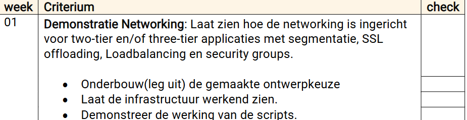

Studentnummer S1203586
Semih Hamurcu

### Ontwerpvraagstuk
De klanten van het Shared Service Center gebruiken veel verschillende multi-tier applicaties. Bedenk hoe het netwerk er technisch uit zou moeten zien. Houd daarbij rekening met aanpasbaarheid, beheerbaarheid, schaalbaarheid,
beschikbaarheid en security.
### Automatiseringsvraagstuk
SSC krijgt regelmatig nieuwe klanten.
Het inrichten van de netwerken voor de multi-tier applicaties is
steeds veel handmatig klikwerk. Welke scripts en welke
technologie kan SSC gebruiken om dit automatiseren?

### Criteria

### Bronnen
AI:
https://chatgpt.com/share/681f5d42-98c8-8007-bc7d-25f7ac2788af

Brightspace:
https://leren.windesheim.nl/d2l/le/lessons/98305/topics/1204082

Microsoft Learn:
https://learn.microsoft.com/en-us/answers/questions/1045766/3-tier-architecture

# Overzicht van de infrastructuur
In dit project is een schaalbare cloudinfrastructuur gerealiseerd in Microsoft Azure, bestaande uit:
* Een Virtual Network (VNet) met drie subnets: subnetWeb, subnetDB en subnetManagement
* Een Azure Public Load Balancer (web loadbalancer) voor inkomend internetverkeer, met een backend pool en health   probe
* Een interne Azure Load Balancer (database loadbalancer) voor verkeer tussen de weblaag en de databaseservers
* Een Virtual Machine Scale Set (VMSS) met twee Ubuntu 22.04-instanties voor de weblaag
* Een Jumpbox VM voor beheer vanuit het subnetManagement
* Network Security Groups (NSG’s) voor toegangscontrole op subnetniveau
* Gebruik van meerdere availability zones voor verhoogde beschikbaarheid en fouttolerantie

##  Onderbouwing ontwerpkeuzes

### ⚙️ Aanpasbaarheid
- Dankzij subnet-segmentatie kunnen componenten los van elkaar beheerd of uitgebreid worden.
- Services zoals NSG’s en load balancers zijn modulair toe te voegen of aan te passen zonder het hele netwerk te herzien.

### 🛠 Beheerbaarheid
- Gebruik van **Jumpbox** maakt beheer van backend-VM’s mogelijk zonder directe externe toegang.
- **Network Security Groups (NSG’s)** per subnet zorgen voor eenvoudige toegangscontrole en overzicht.

### 📈 Schaalbaarheid
- Weblaag ondersteunt **VM Scale Sets**, wat automatische horizontale schaalvergroting mogelijk maakt.
- Load balancer backend pools kunnen eenvoudig uitgebreid worden met extra VM’s.

### 🛡 Security
- NSG's zorgen voor **microsegmentatie** en beperken verkeer per subnet.
- Jumpbox voorkomt directe toegang tot backend.
- Subnets scheiden web- en datalaag fysiek op netwerklaag.

### 🔁 Beschikbaarheid
- **Availability Zones** zorgen voor failover-mogelijkheden in meerdere datacenters.
- **Standard Load Balancers** ondersteunen redundantie en health probes.

